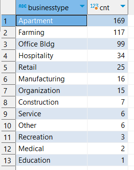

# Data Migration
This documentation entails all steps involved in migrating .xlsx or .xls excel file data to remote postgresql database along with all the queries required to view and filter the data.

This documentation will provide information on how to convert data files like this:


To something that looks like this:
```
select * from sample_insurance_tbl
```


And operations like these could be performed for further data analysis:
```
select location, count(*) as cnt from sample_insurance_tbl group by location order by cnt desc;
```


```
select region, count(*) cnt from sample_insurance_tbl group by region order by cnt asc;
```


```
select businesstype, count(*) cnt from sample_insurance_tbl group by 1 order by 2 desc;
```


And many more operations can be done on the data to reveal new insights hiding therein.

## 1 - Preparing the data files for ingestion
Excel files with .xls or xlsx file extensions are not friendly enough for raw data extraction due to their nested nature (as in having multiple pages within). Therefore the data within each of those pages in the excel file needs to be extracted into csv files.

The following two .xlsx files without macros have been downloaded as test files to work on from [Excel Sample Data](https://www.contextures.com/xlsampledata01.html).


This portion of the documentation will use the `SampleData_Insurance.xlsx` file.

To export the datafile as a csv file, all that is needed is to save file file as a csv file while on the data page in the excel file.


In this `SampleData_Insurance.xlsx` file, the highlighted `PolicyData` page is the data page that needs to be exported.


Under the underlined File tab, the highlighted `Save As` button can be seen and once clicked...


The file name and path can be changed as desired but the `Save as type` must be changed to CSV (Comma delimited) (*.csv) as highlighted. And then click the `Save` button.


Click `OK` or `Yes` at the event of the following prompts:


Now close the excel window and click `Don't Save` at this prompt:


We should now have the exported csv file in our taget location.


Now we need to open the csv file as raw text without any of excel's formating.

Right click on the file to show the `Open with` option
.

Under `Open with` select `Notepad` if available, otherwise, select `Choose another app` and choose `Notepad` and select `Just once` (Recommended) or `Always`.
.

The file should look like this in its raw form:


Now, this is a much easier data file to work with.

Repeat this for all the data files you have to prepare each of them for migration.


## 2 - Installing SQL Client Application
There are a multitude of free SQL Client Applications available online, and almost any of them can be used in for this migration task, however, [DBeaver](https://dbeaver.io) is the application being used for this task. Navigate to the DBeaver website, `https://dbeaver.io`, or search DBeaver on google and navigate to their home page.


Click the download button to navigate to the download page.


The host system for this migration uses a Window's Operating System so the `Windows (Installer)` version was clicked and downloaded. Choose your appropriate operating system installer.


Once the installer has been downloaded, double click on it to install the application.

Click the higlighted/pointed out options for all following prompts...


We should then see this icon on the desktop and in `Start`.


Double click on the Idon to Launch `DBeaver` SQL client application.


## 3 - Setup Remote PostgreSQL Database
